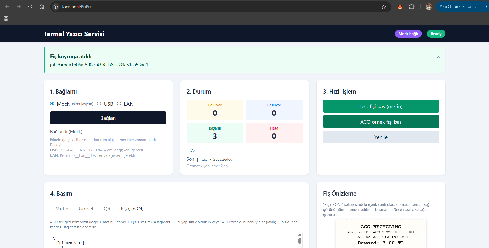
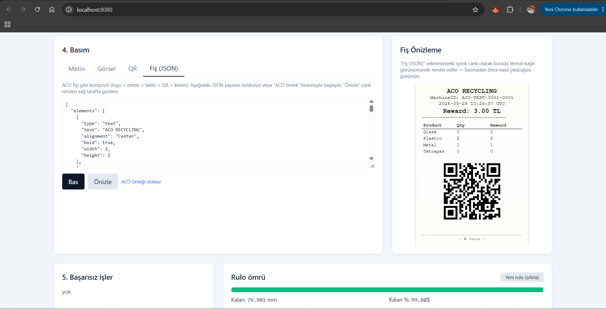
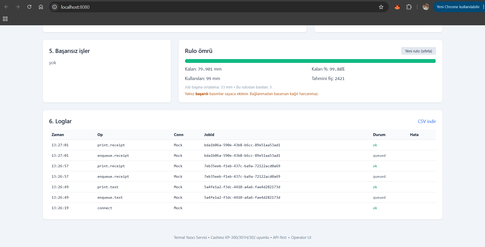

# Termal Yazıcı Servisi

ESC/POS uyumlu termal yazıcılar (**Cashino KP-300 / KP-301H / KP-302**) için **.NET 8 / ASP.NET Core (C#)** üzerine inşa edilmiş, **Clean Architecture** prensiplerine göre katmanlandırılmış, test edilebilir bir Web API + Operatör UI servisi. USB (Virtual COM) ve LAN (TCP 9100) bağlantı türlerini tek bir HTTP arayüzünden yönetir; iş kuyruğu, otomatik yeniden bağlanma, durum makinesi, kalıcı log ve restart-survival reprint kutudan çıktığı haliyle çalışır.

**Donanım yok mu?** Mock modu (`POST /connect {"mode":"Mock"}`) ile uçtan uca akışı dener; fiziksel yazıcı gerekmez.

## Tek komutla çalıştırma

```bash
# Docker (önerilen, tek satır)
docker compose up -d --build
# -> http://localhost:8080/  (Operatör UI)

# VEYA yerel .NET 8 SDK ile
dotnet run --project src/ThermalPrinterService.Api
# -> http://localhost:8080/  (launchSettings.json varsayılan portu)
```

| Stack | Detay |
|---|---|
| Backend | C# / .NET 8 / ASP.NET Core 8 / xUnit |
| Frontend | Vanilla HTML + Tailwind CSS (CDN) + qrcode-generator (CDN) — **build adımı yok** |
| Container | Multi-stage Dockerfile (sdk:8.0 → aspnet:8.0), non-root, healthcheck, named volumes |
| Persistence | Loglar JSONL (disk), failed jobs JSON (disk, restart-survival), queue/idempotency/paper in-memory |
| Test | 143 otomatik test (118 unit + 25 integration), `WebApplicationFactory` + `FakePrinter` |

## Ekran görüntüleri





---

## İçindekiler

- [Özellikler](#özellikler)
- [Mimari](#mimari)
- [Önkoşullar](#önkoşullar)
- [Hızlı Başlangıç (Yerel)](#hızlı-başlangıç-yerel)
- [Yapılandırma](#yapılandırma)
- [Docker ile Çalıştırma](#docker-ile-çalıştırma)
- [API Referansı](#api-referansı)
- [Loglama](#loglama)
- [Yazıcı Durum Makinesi](#yazıcı-durum-makinesi)
- [Test](#test)
- [Klasör Yapısı](#klasör-yapısı)
- [Üretim Ölçeklendirmesi](#üretim-ölçeklendirmesi)
- [Yol Haritası](#yol-haritası)

---

## Özellikler

- **Operatör UI** (`/`): bağlantı modu + state badge, hızlı bas, canlı status, kuyruk, hata banner + "Tekrar Bastır" butonu, log viewer + CSV indir
- Çift bağlantı modu: **USB** (`System.IO.Ports.SerialPort`) ve **LAN** (`TcpClient`, ESC/POS port 9100)
- Üretici-tüketici yapısı: `System.Threading.Channels` üzerine kurulu asenkron kuyruk + `BackgroundService` worker
- Otomatik yeniden bağlanma: **Exponential backoff + jitter**, sürücü değişiminde sayaç sıfırlama
- Durum yönetimi: doğrulanmış geçişlerle thread-safe **state machine** + **4-katmanlı status sorgusu** (Cashino `DLE EOT 1/2/3/4`) ve önceliklendirici reducer
- **Composit fiş (`/print/receipt`)**: logo (PNG/JPEG → 1bpp raster), metin (Türkçe CP1254, font/bold/boyut/hizalama), tablo, QR kod, ayırıcı, kesim
- **QR kod** (standalone `/print/qr` veya receipt içinde): ESC/POS `GS ( k` standart komut zinciri
- **Image raster**: ImageSharp ile grayscale + threshold → 1bpp → `GS v 0` raster bitmap
- **Idempotency-Key** header desteği: aynı key/10 dk içinde tekrarlanan istek tek basım üretir
- **API key auth** (opsiyonel, env-driven), **`/health` + `/health/ready`** probe'ları, **CSV log export**
- **ETA tahmini**: son 20 başarılı işin yuvarlanan ortalamasından kuyruk bitiş süresi (`status.queue.etaSeconds`)
- **Son iş bilgisi** (`status.lastJob`): UI/operator için son tamamlanan job özeti
- Kalıcı log: **JSONL** (atomic append, eş zamanlı okuma) — şema `{ts, op, conn, jobId, status, error:{code, detail}}`
- **Restart-survival reprint**: başarısız işler disk'e arşivlenir (`failed-jobs/{jobId}.json`); servis restart edildikten sonra bile `/reprint` çalışır
- Hata yönetimi: ProblemDetails ile kullanıcı dostu yanıtlar, stack trace sızdırmaz middleware
- Konfigürasyon: `appsettings.json` + `.env` override — **kod içinde hiçbir gömülü yol/credential yok**
- Hazır docker-compose + multi-stage Dockerfile, non-root container, healthcheck

---

## Mimari

```
+--------------------+      +--------------------+      +--------------------+
|        Api         | ---> |   Infrastructure   | ---> |    Application     |
|  (Controllers,     |      | (UsbPrinter,       |      | (IPrinterService,  |
|   Middleware, DI)  |      |  LanPrinter,       |      |  IPrintQueue,      |
|                    |      |  Channels Queue,   |      |  ILogStore,        |
|                    |      |  JSONL LogStore,   |      |  StateMachine)     |
|                    |      |  Reconnect Bg Svc) |      |                    |
+--------------------+      +---------+----------+      +---------+----------+
                                      |                           |
                                      v                           v
                                +-----+---------------------------+-----+
                                |               Domain                  |
                                |   (Entities, Enums - bagimsiz)        |
                                +---------------------------------------+
```

Bağımlılık yönü tek yönlüdür: **Api -> Infrastructure -> Application -> Domain**. Domain hiçbir şeye bağlı değildir; Application sadece Domain'i bilir; Infrastructure tüm I/O detaylarını saklar; Api hiçbir concrete tipi tanımaz, yalnızca arayüzleri kullanır.

---

## Önkoşullar

| Bileşen | Sürüm | Notlar |
|---|---|---|
| .NET SDK | 8.0+ | Yerel geliştirme ve `dotnet test` için |
| Docker | 24+ | Container ile çalıştırmak için |
| Docker Compose | v2+ | `docker compose` komutu |
| Termal yazıcı | ESC/POS | İsteğe bağlı; servis bağlantısız da ayağa kalkar |

---

## Hızlı Başlangıç (Yerel)

```bash
# 1) Bağımlılıkları geri yükle ve derle
dotnet restore ThermalPrinterService.sln
dotnet build  ThermalPrinterService.sln --no-restore

# 2) Birim testlerini koştur
dotnet test tests/ThermalPrinterService.UnitTests --no-build

# 3) API'yi başlat (varsayılan port 8080)
dotnet run --project src/ThermalPrinterService.Api
```

API ayağa kalktığında:
- **`http://localhost:8080/`** — Operatör UI dashboard
- **`http://localhost:8080/swagger`** — Swagger interaktif API explorer

### Port hakkında net bilgi

Servis hangi portta dinleyeceğini şu sırayla seçer (en yüksek öncelikten en düşüğe):

1. **Komut satırı**: `--urls http://localhost:XXXX`
2. **Environment**: `ASPNETCORE_URLS=http://localhost:XXXX`
3. **`launchSettings.json` profili** (sadece `dotnet run` veya IDE ile başlatılırsa kullanılır): bu repoda `http` profili **`http://localhost:8080`** olarak set edilmiştir
4. **Built-in default**: ASP.NET Core kendi varsayılanı (`http://localhost:5000` + `https://localhost:5001`)

> **Doğrulanmış davranış (bu repo, .NET 8 SDK, Windows):**
> - `dotnet run --project src/ThermalPrinterService.Api` → **8080** (launchSettings'ten geliyor)
> - `dotnet run --project src/ThermalPrinterService.Api --launch-profile https` → **https://localhost:7006 + http://localhost:8080**
> - `dotnet run --project src/ThermalPrinterService.Api --no-launch-profile` → **5000/5001** (ASP.NET default)
> - `dotnet src/ThermalPrinterService.Api/bin/Debug/net8.0/ThermalPrinterService.Api.dll` (compiled DLL doğrudan) → **5000/5001**
> - Docker container → **8080** (Dockerfile'da `ASPNETCORE_URLS=http://+:8080` ENV var; compose `8080:8080` mapping)

Başka bir port istiyorsan:

```bash
# Yöntem A — --urls override
dotnet run --project src/ThermalPrinterService.Api --urls http://localhost:3000

# Yöntem B — env değişkeni
$env:ASPNETCORE_URLS = "http://localhost:3000"
dotnet run --project src/ThermalPrinterService.Api

# Yöntem C — launchSettings.json düzenle
# src/ThermalPrinterService.Api/Properties/launchSettings.json
# "applicationUrl": "http://localhost:3000"
```

`dotnet run` çıktısının üst kısmında **`Now listening on: http://localhost:XXXX`** satırı **mutlaka** görünür — port emin olmak için oraya bak.

> **Fiziksel cihaz gerekmez!** `ConnectionMode.Mock` ile uçtan uca akışı dene (UI'de varsayılan):
>
> ```bash
> curl -X POST http://localhost:8080/connect -H "Content-Type: application/json" -d '{"mode":"Mock"}'
> curl -X POST http://localhost:8080/print/text -H "Content-Type: application/json" -d '{"text":"merhaba"}'
> curl http://localhost:8080/status
> ```
>
> `Mock` modu her zaman bağlı + `Ready`; basılan baytlar bellekte ve log'da gözlenebilir. Gerçek cihaz için `Usb` veya `Lan` modunu seç + `Printer__Usb__PortName` ya da `Printer__Lan__Host` env değişkenini doldur.

---

## Yapılandırma

Tüm yapılandırma `appsettings.json` içindeki `Printer` bölümünde tanımlıdır ve environment değişkenleriyle (**çift alt çizgi `__` hiyerarşi ayracıdır**) override edilebilir.

### `.env` dosyası

Repo kök dizininde örnek bir dosya bulunur: `.env.example`. Kendi makineniz için kopyalayın:

```bash
cp .env.example .env
```

İçeriği:

```ini
# USB
Printer__Usb__PortName=COM3
Printer__Usb__BaudRate=9600

# LAN
Printer__Lan__Host=192.168.1.50
Printer__Lan__Port=9100
Printer__Lan__ConnectTimeoutMs=3000

# Genel
Printer__CommandTimeoutMs=5000
Printer__StatusPollIntervalMs=2000

# Loglama
Printer__Logs__FilePath=logs/printer-logs.json

# Yeniden baglanma (exponential backoff + jitter)
Printer__Reconnect__InitialDelayMs=1000
Printer__Reconnect__MaxDelayMs=30000
Printer__Reconnect__Multiplier=2.0
Printer__Reconnect__JitterFactor=0.2

# ASP.NET Core
ASPNETCORE_ENVIRONMENT=Development
ASPNETCORE_URLS=http://+:8080
```

### Önemli ayarlar

| Anahtar | Tip | Varsayılan | Açıklama |
|---|---|---|---|
| `Printer__Usb__PortName` | string | _(boş)_ | Windows için `COM3`, Linux için `/dev/ttyUSB0` |
| `Printer__Usb__BaudRate` | int | `9600` | Yazıcı belgenize göre |
| `Printer__Lan__Host` | string | _(boş)_ | Yazıcının LAN üzerindeki IP'si |
| `Printer__Lan__Port` | int | `9100` | ESC/POS standart portu |
| `Printer__PrintableWidthDots` | int | `384` | **KP-300: 384, KP-302: 576, KP-301H: 640.** Image raster ve receipt composer bu genişliğe sığdırır. |
| `Printer__StatusPollIntervalMs` | int | `2000` | `0` verilirse status polling kapanır |
| `Printer__Logs__FilePath` | string | `logs.json` | Bağıl yol `ContentRoot`'a göre çözülür |
| `Printer__Reconnect__InitialDelayMs` | int | `1000` | İlk yeniden bağlanma denemesi öncesi bekleme |
| `Printer__Reconnect__MaxDelayMs` | int | `30000` | Backoff'un üst sınırı |
| `Printer__Reconnect__Multiplier` | double | `2.0` | Üs alma çarpanı |
| `Printer__Reconnect__JitterFactor` | double | `0.2` | `0`–`1` arası; `0` deterministik |

> **Güvenlik notu:** USB cihaz yolu, LAN IP'si ve port gibi makineye özel bilgiler **`appsettings.json` içinde boş bırakılmıştır**. Üretim ortamına yalnızca environment / `.env` üzerinden geçirin; gizli bilgileri repoya commit'lemeyin.

---

## Docker ile Çalıştırma

### Tek komutla ayağa kaldırma

```bash
cp .env.example .env
# .env'i kendi yapilandirmaniza gore duzenleyin

docker compose up -d --build
docker compose logs -f thermal-printer-service
```

Servis varsayılan olarak `http://localhost:8080` üzerinden yanıt verir. Healthcheck `/status` endpoint'ini kullanır; `docker compose ps` çıktısında durum görünür.

### USB yazıcı bağlantısı (Linux host)

`docker-compose.yml` içindeki ilgili satırları açın:

```yaml
devices:
  - "/dev/ttyUSB0:/dev/ttyUSB0"
group_add:
  - "dialout"
```

Ardından `.env` içinde `Printer__Usb__PortName=/dev/ttyUSB0` olarak ayarlayın.

### LAN yazıcı bağlantısı

Yazıcı, host'un erişebildiği bir IP'ye sahipse ek yapılandırma gerekmez. Container varsayılan bridge ağı üzerinden NAT ile yazıcıya ulaşır. Sadece `.env` içinde `Printer__Lan__Host` değerini girin.

### Loglar

Log dosyası container içinde `/var/log/printer/logs.json` yolundadır ve `printer-logs` adlı named volume'da kalıcıdır:

```bash
docker compose exec thermal-printer-service tail -f /var/log/printer/logs.json
```

### Servisi durdurma

```bash
docker compose down            # Container'ları durdur (volume korunur)
docker compose down --volumes  # Logları da temizle
```

---

## Operatör UI

API çalışınca tarayıcıdan `http://localhost:8080/` adresini açın — tek sayfalık dashboard:


- **Header**: aktif bağlantı modu (USB/LAN), printer state badge (Ready/PaperOut/CoverOpen/Disconnected vb. renk-kodlu)
- **1. Bağlantı kartı**: USB/LAN radio + `Bağlan` butonu → `POST /connect`
- **2. Durum kartı**: bekleyen/basılıyor/hata sayaçları, **ETA (sn)**, **son iş** özeti
- **3. Hızlı işlem**: Test fişi ve ACO örnek fişi tek tıkla basar
- **4. Basım sekmeleri**: Metin / Görsel (dosya upload) / QR / Fiş (JSON)
- **5. Başarısız işler**: son 10 failed job + her birinin yanında **`Tekrar Bastır`** butonu (→ `POST /reprint/{jobId}`)
- **6. Loglar**: son 50 satır canlı tablo, hata kodları renkli; **CSV indir** linki

2 saniyede bir auto-refresh; bir hata oluşursa üst banner kullanıcı dostu mesaj gösterir.

Stack: vanilla HTML + Tailwind CSS (CDN) + saf JS fetch — **build adımı yok**, tek dosyalı dashboard (`src/ThermalPrinterService.Api/wwwroot/index.html`).

> Auth açıksa UI tarayıcı `localStorage.apiKey` değerini kullanır. Tarayıcı konsolunda `localStorage.setItem('apiKey', '<value>')` ile set edebilirsiniz.

---

## API Referansı

Tüm uçlar `application/json` ile çalışır. Aşağıdaki örneklerde `BASE_URL` olarak `http://localhost:8080` varsayıldı.

> **Postman**: tüm endpoint'lerin hazır collection'ı `postman/ThermalPrinterService.postman_collection.json` içinde. Postman'da `Import` → `File` → seç → `baseUrl` değişkenini kendi adresine ayarla. `apiKey` boş kalırsa header gönderilmez (auth kapalıyken doğru davranış).

### Özet tablo

| Method | Path | Açıklama | Başarı |
|---|---|---|---|
| `GET`  | `/` | **Operatör UI** (HTML dashboard) | `200 OK` |
| `POST` | `/connect` | Bağlantı modunu seçer, sürücüyü oturuma yerleştirir | `200 OK` |
| `POST` | `/print/text` | Metin işini kuyruğa atar | `202 Accepted` |
| `POST` | `/print/image` | Base64 görsel işini kuyruğa atar | `202 Accepted` |
| `POST` | `/print/qr` | Standalone QR kod kuyruğa atar | `202 Accepted` |
| `POST` | `/print/receipt` | Composit fiş (logo + metin + QR + tablo + cut) kuyruğa atar | `202 Accepted` |
| `GET`  | `/status` | Bağlantı + state + kuyruk özeti + **son iş** + **ETA** | `200 OK` |
| `GET`  | `/logs` | Tüm log kayıtları (JSON array, `error` = `{code, detail}`) | `200 OK` |
| `GET`  | `/logs/export.csv` | RFC 4180 CSV indirme (Excel/Sheets açabilir) | `200 OK` |
| `POST` | `/reprint/{jobId}` | Başarısız bir işi tekrar tetikler | `202 Accepted` |
| `GET`  | `/paper` | Rulo ömrü snapshot'ı (kalan mm, %, tahmini fiş) | `200 OK` |
| `POST` | `/paper/reset` | Yeni rulo takıldı; sayaç sıfırlanır | `200 OK` |
| `GET`  | `/health` | Liveness probe (her zaman Healthy, servis ayakta) | `200 OK` |
| `GET`  | `/health/ready` | Readiness probe (yazıcı bağlı mı?) | `200`/`503` |

**Tüm POST endpoint'leri** opsiyonel `Idempotency-Key: <string>` header'ı kabul eder — aynı key/10 dk içinde tekrarlanan istek aynı `jobId`'yi döner, sadece **bir kez** basılır.

**API key auth** (opsiyonel): `Printer__Auth__ApiKey` env değişkeni doluysa tüm istekler `X-Api-Key: <value>` header'ı taşımak zorunda. `/health`, `/health/ready`, `/swagger`, UI statik dosyaları muaf. Boş bırakılırsa auth devre dışı (yerel geliştirme için).

### `POST /connect`

Yazıcı sürücüsünü seçer ve aktif oturuma yerleştirir. **Reconnect/backoff arka plan servisinin sorumluluğundadır**; bu uç yalnızca tetikler.

```bash
curl -X POST http://localhost:8080/connect \
     -H "Content-Type: application/json" \
     -d '{"mode":"Lan"}'
```

```json
{
  "connected": true,
  "mode": "Lan",
  "message": "connected"
}
```

`mode` değerleri: `Mock`, `Usb`, `Lan`.

- **`Mock`** — simülasyon: gerçek donanım olmadan akışı dener (her zaman bağlı, Ready). UI varsayılanı.
- **`Usb`** — `Printer__Usb__PortName` env değişkeni zorunlu (örn. `COM3` / `/dev/ttyUSB0`)
- **`Lan`** — `Printer__Lan__Host` env değişkeni zorunlu (örn. `192.168.1.50`)

### `POST /print/text`

```bash
curl -X POST http://localhost:8080/print/text \
     -H "Content-Type: application/json" \
     -d '{"text":"Acoryclyc Test Print\nLine 2\n"}'
```

```json
{ "jobId": "e1b2fe89-6d5a-472e-a3af-599d82a7d66b", "status": "queued" }
```

### `POST /print/image`

`ImageBase64` alanı zorunludur; base64 decode başarısız olursa `400 ProblemDetails` döner.

```bash
# Ornek: kucuk bir PNG'yi base64 olarak gonder
B64=$(base64 -w0 ./test.png)
curl -X POST http://localhost:8080/print/image \
     -H "Content-Type: application/json" \
     -d "{\"imageBase64\":\"$B64\"}"
```

### Çoklu dil — `POST /print/text`

Backend Türkçe için `CP1254` (Windows-1254) codepage set eder; bu setting İngilizce + Türkçe + Fransızca + Almanca dahil tüm Latin diakritiklerini kapsar. Client istediği dilde metin gönderir, server byte'ları doğru encode eder.

```bash
# Türkçe
curl -X POST http://localhost:8080/print/text \
     -H "Content-Type: application/json; charset=utf-8" \
     -d '{"text":"İade tutarı: 3.00 ₺ — Teşekkür ederiz."}'

# English
curl -X POST http://localhost:8080/print/text \
     -H "Content-Type: application/json; charset=utf-8" \
     -d '{"text":"Refund: 3.00 EUR — Thank you for recycling."}'

# Français
curl -X POST http://localhost:8080/print/text \
     -H "Content-Type: application/json; charset=utf-8" \
     -d '{"text":"Remboursement: 3,00 € — Merci de votre démarche écologique."}'

# Deutsch
curl -X POST http://localhost:8080/print/text \
     -H "Content-Type: application/json; charset=utf-8" \
     -d '{"text":"Rückgabe: 3,00 EUR — Vielen Dank für Ihr Engagement. Straße: Hauptstr. 12"}'
```

> **Not:** `₺` (Türk Lira) ESC/POS karakter setlerinde yok; composer otomatik olarak `TL` literal'ine çevirir. `€` ise CP1254'te 0x80; doğrudan basılır. Diğer Latin diakritikler (é, ç, ä, ö, ü, ß, à, ô, ù, ı, ş, ğ, İ) hepsi CP1254'te native.

### `POST /print/qr`

Standalone QR kod. `data` zorunlu; `moduleSize` 1-16, `ecc` L/M/Q/H.

```bash
curl -X POST http://localhost:8080/print/qr \
     -H "Content-Type: application/json" \
     -d '{"data":"https://aco.test/r/12345","moduleSize":6,"ecc":"M","alignment":"Center"}'
```

### `Idempotency-Key` kullanımı

```bash
# Aynı key ile iki çağrı → aynı jobId döner, **bir kez** basılır.
curl -X POST http://localhost:8080/print/text \
     -H "Content-Type: application/json" \
     -H "Idempotency-Key: ACO-RECEIPT-12345" \
     -d '{"text":"merhaba"}'
```

### API key auth (opsiyonel)

```bash
# .env: Printer__Auth__ApiKey=secret-token
curl -X POST http://localhost:8080/print/text \
     -H "Content-Type: application/json" \
     -H "X-Api-Key: secret-token" \
     -d '{"text":"merhaba"}'
```

### `GET /logs/export.csv`

```bash
curl -OJ http://localhost:8080/logs/export.csv
# -> printer-logs-20260527-103245.csv
```

### `GET /paper` + `POST /paper/reset`

Rulo ömrü kestirim mantığı:
- **Text job**: satır sayısı × satır yüksekliği (24-dot font @ 203 dpi ≈ **3 mm/satır**)
- **Image job**: konfigürasyondaki ortalama görsel yüksekliği (varsayılan 40 mm)
- **Raw (composer) job**: payload içindeki **LF byte sayısı × satır yüksekliği** + içindeki **`GS v 0` raster bitmap header'larından okunan `y` dot/8 = mm**
- Her job sonunda kesim için **5 mm fixed overhead**

Operatör rulo değiştirdiğinde `/paper/reset` çağrılır.

```bash
curl http://localhost:8080/paper
# {
#   "usedMm": 1234.5,
#   "rollLengthMm": 80000,
#   "remainingMm": 78765.5,
#   "remainingPercent": 98.46,
#   "printedJobCount": 47,
#   "averageJobMm": 26.27,
#   "estimatedJobsRemaining": 2999
# }

curl -X POST http://localhost:8080/paper/reset
```

UI sağ alttaki "Rulo ömrü" kartında progress bar (yeşil > %30 > sarı > %10 > kırmızı), kullanılan/kalan mm, tahmini fiş, ortalama mm/iş gösterir; "Yeni rulo (sıfırla)" butonu var.

Konfigürasyon (env override):

```ini
Printer__Paper__RollLengthMeters=80.0
Printer__Paper__AverageLineHeightMm=3.0
Printer__Paper__AverageImageHeightMm=40.0
Printer__Paper__CutOverheadMm=5.0
```

### `GET /health` + `/health/ready`

```bash
curl http://localhost:8080/health         # liveness, her zaman 200 OK
curl -i http://localhost:8080/health/ready # readiness, 503 (Degraded) printer yokken
```

### `POST /print/receipt`

Kompozit fiş basımı. Element listesi sırayla işlenir: `text`, `image`, `qr`, `table`, `feed`, `separator`, `cut`. Composer Türkçe **CP1254** karakter setini set eder; `₺`, `€` gibi ESC/POS karşılığı olmayan karakterler güvenli karşılıklara (`TL`, `EUR`) çevrilir.

ACO Recycling fişine birebir benzer bir örnek:

```bash
LOGO_B64=$(base64 -w0 ./aco-logo.png)

curl -X POST http://localhost:8080/print/receipt \
     -H "Content-Type: application/json" \
     -d @- <<EOF
{
  "elements": [
    { "type": "image", "imageBase64": "$LOGO_B64", "alignment": "Center" },
    { "type": "text", "text": "ACO RECYCLING", "alignment": "Center", "bold": true },
    { "type": "text", "text": "MachineID: ACO-TEST-0001-0001", "alignment": "Center" },
    { "type": "text", "text": "16 Eylül 2025 16:19:02 UTC", "alignment": "Center" },
    { "type": "text", "text": "Reward: 3.00 ₺", "alignment": "Center", "width": 2, "height": 2 },
    { "type": "separator", "character": "-" },
    {
      "type": "table",
      "headers": ["Product", "Qty", "Reward"],
      "rows": [
        ["Glass",    "0", "0"],
        ["Plastic",  "2", "2"],
        ["Metal",    "1", "1"],
        ["Tetrapak", "0", "0"]
      ]
    },
    { "type": "feed", "lines": 2 },
    { "type": "qr", "qrData": "https://aco.test/r/ACO-TEST-0001-0001", "qrModuleSize": 6, "qrEcc": "M" },
    { "type": "feed", "lines": 3 },
    { "type": "cut", "feedDots": 30 }
  ]
}
EOF
```

```json
{ "jobId": "...", "status": "queued" }
```

**Element referansı:**

| Type | Zorunlu | Opsiyonel |
|---|---|---|
| `text` | `text` | `alignment` (Left/Center/Right), `bold`, `width` (1-8), `height` (1-8), `underline` |
| `image` | `imageBase64` | `alignment` |
| `qr` | `qrData` | `qrModuleSize` (1-16), `qrEcc` (L/M/Q/H), `alignment` |
| `table` | `headers`, `rows` | `headerBold` |
| `feed` | — | `lines` (default 1) |
| `separator` | — | `character` (default `-`) |
| `cut` | — | `feedDots` (default 30) |

### `GET /status`

```bash
curl http://localhost:8080/status
```

```json
{
  "connected": true,
  "mode": "Lan",
  "state": "Ready",
  "queue": { "pending": 0, "inFlight": 0, "failed": 1, "etaSeconds": null },
  "lastJob": {
    "jobId": "abc12345-0000-4000-a000-000000000001",
    "kind": "Raw",
    "status": "Succeeded",
    "completedAt": "2026-05-27T10:22:51.612+03:00",
    "attempts": 1,
    "errorCode": null,
    "errorDetail": null
  }
}
```

### `GET /logs`

```bash
curl http://localhost:8080/logs
```

```json
[
  { "ts": "2026-05-27T20:18:38.7334874+00:00",
    "op": "enqueue.text",
    "jobId": "e1b2fe89-6d5a-472e-a3af-599d82a7d66b",
    "status": "queued" },
  { "ts": "2026-05-27T20:18:38.7351785+00:00",
    "op": "print.text",
    "jobId": "e1b2fe89-6d5a-472e-a3af-599d82a7d66b",
    "status": "failed",
    "error": "no_connection" }
]
```

### `POST /reprint/{jobId}`

Sadece `Failed` veya `Cancelled` durumundaki bir işi tekrar kuyruğa alır. Bulunamayan `jobId` için `404 ProblemDetails` döner.

```bash
curl -X POST http://localhost:8080/reprint/e1b2fe89-6d5a-472e-a3af-599d82a7d66b
```

```json
{ "jobId": "e1b2fe89-6d5a-472e-a3af-599d82a7d66b", "status": "requeued" }
```

---

## Loglama

### Format

Diskte **JSONL** (newline-delimited JSON) — atomic append'i ucuz yapar ve kısmi yazımlardan etkilenmez. API tarafında düz JSON dizisi olarak deserialize edilip döndürülür.

```
{"ts":"2026-05-27T10:16:33.901+03:00","op":"enqueue.text","conn":"Lan","jobId":"4abbb832-...","status":"queued"}
{"ts":"2026-05-27T10:16:33.945+03:00","op":"print.text","conn":"Lan","jobId":"4abbb832-...","status":"ok"}
{"ts":"2026-05-27T10:19:48.514+03:00","op":"print.receipt","conn":"Lan","jobId":"675a3970-...","status":"failed","error":{"code":"PAPER_OUT","detail":"Yazıcı kağıt sensörü kağıt bittiğini bildirdi."}}
```

> Gerçek örneklerin tamamı [`samples/logs.json`](samples/logs.json) içinde.

### Şema

| Alan | Tip | Açıklama |
|---|---|---|
| `ts` | ISO 8601 | UTC offset dahil zaman damgası |
| `op` | string | `connect`, `reconnect`, `enqueue.text`, `enqueue.image`, `enqueue.qr`, `enqueue.receipt`, `print.text`, `print.image`, `print.receipt`, `reprint` |
| `conn` | enum? | `Usb` / `Lan` — bilinmiyorsa atlanır |
| `jobId` | guid? | Job tabanlı operasyonlarda doldurulur |
| `status` | string | `queued`, `ok`, `failed`, `pending` |
| `error` | object? | `{code, detail}` — yalnızca hata durumunda |

### Hata kodları (`error.code`)

| Kod | Anlam |
|---|---|
| `PAPER_OUT` | Kağıt yok (sensör tetikledi) |
| `PAPER_JAM` | Cutter sıkıştı / mekanik hata |
| `COVER_OPEN` | Kapak açık |
| `OVERHEAT` | Kafa aşırı ısındı (otomatik recovery beklenir) |
| `COMM_ERROR` | İletişim hatası (kalıcı / unrecoverable) |
| `UNKNOWN_COMMAND` | Bilinmeyen ESC/POS komutu |
| `NO_CONNECTION` | Worker iş aldı ama oturumda bağlı yazıcı yok |
| `INVALID_INPUT` | Validation hatası (boş, format vb.) |
| `INVALID_IMAGE` | Bozuk base64 / decode edilemeyen görsel |
| `JOB_NOT_FOUND` | `/reprint` için bilinmeyen jobId |
| `COMPOSE_FAILED` | Receipt composer hata fırlattı |
| `CONNECT_FAILED` | İlk bağlanma denemesi başarısız |
| `PRINT_FAILED` | Basım sırasında genel hata |

Yazımlar `SemaphoreSlim` ile serileştirilir. Aynı anda gelen okuma istekleri (`FileShare.ReadWrite`) yazıcıyı bloklamaz; bozuk satırlar atlanır, log yazımı başarısız olursa servis ayakta kalır.

---

## Yazıcı Durum Makinesi

Doğrulanmış geçiş matrisi `Application/StateMachine/PrinterTransition.cs` içindedir. Geçersiz bir geçiş `InvalidOperationException` fırlatır; arka plan servisleri `CanTransitionTo` ile guard'lı çalışır.

```
                       +---------------+
                       | Disconnected  |
                       +-------+-------+
                          |         |
                  connect |         | connect failed
                          v         v
                +-------+-+    +----+-------+
                | Ready  | <-> | CommError  |
                +---+----+    +------+-----+
                    |                |
   PaperOut/PaperJam/CoverOpen/      |
   Overheat/UnknownCommand           |
                    |                |
                    v                v
              +-----+----+   +-------+-----+
              |  Fault   |   |   herhangi  |
              | states   |---|   gozlenen  |
              +-----+----+   |    durum    |
                    |        +-------------+
                    v
                  Ready (recovery) | Disconnected | CommError
```

Polling worker (`ReconnectBackgroundService`) `StatusPollIntervalMs` aralığında `QueryStateAsync` çağırır ve sonucu state machine'e besler. State machine'in `Transitioned` event'i ile log/metric uçları kolayca eklenebilir.

---

## Test

Proje **143 otomatik test** içerir (118 unit + 25 integration); iki ayrı projede toplanır:

```bash
# Sadece birim testler (hizli, no host)
dotnet test tests/ThermalPrinterService.UnitTests

# Sadece entegrasyon testler (WebApplicationFactory + FakePrinter)
dotnet test tests/ThermalPrinterService.IntegrationTests

# Hepsi
dotnet test ThermalPrinterService.sln
```

### Birim testler (118 adet)

| Test dosyası | Kapsam |
|---|---|
| `BackoffAndStateMachineTests.cs` | `ExponentialBackoff` cap + jitter band; `PrinterStateMachine` geçiş matrisi, event davranışı, reset |
| `InMemoryPrintQueueTests.cs` | enqueue/dequeue, `RequeueAsync` kuralları (yalnızca `Failed/Cancelled`), summary sayımları |
| `JsonFileLogStoreTests.cs` | append+read roundtrip, eş zamanlı yazımlar (8 yazar × 25 satır), null alanların serileştirmeden atlanması |
| `EscPosCommandsTests.cs` | 4-katmanlı DLE EOT yorumu (Printer/Offline/Error/PaperSensor), priority `CombineStates` reducer, alignment/bold/underline/text-size/codepage/feed/cut byte sequenceleri |
| `QrCommandsTests.cs` | `GS ( k` zincirinin 5 alt komutu, pL/pH iki byte uzunluk, model/ECC/modül-boyutu seçimi, geçersiz girdiler |
| `MonochromeImageEncoderTests.cs` | PNG → grayscale → threshold → 1bpp → `GS v 0` header; MSB-first bit packing; 8'in katına yuvarlama; max-width ölçekleme |
| `EscPosReceiptComposerTests.cs` | Init + Türkçe CP1254; text/separator/table/qr/image/cut byte üretimleri; `₺` → `TL` fallback; ACO benzeri tam receipt payload sıhhati |
| `InMemoryIdempotencyStoreTests.cs` | Aynı key → aynı jobId; farklı key → farklı; TTL expiry; 20 concurrent çağrı tek factory invocation |
| `MockPrinterTests.cs` | Mock mode başlangıç state'i, connect → Ready, print counter'ları, disconnect davranışı |
| `PaperUsageEstimatorTests.cs` | Text (LF sayısı × satır yüksekliği), Image (ortalama), Raw (LF + GS v 0 raster header taraması), boş payload edge case |
| `FileSystemFailedJobArchiveTests.cs` | Text/Image/Raw job roundtrip, missing dir, delete, atomic overwrite, unknown id no-op |

### Entegrasyon testler (25 adet)

`WebApplicationFactory<Program>` ile gerçek HTTP üzerinden, ancak yazıcı yerine in-memory `FakePrinter` enjekte edilerek çalışır. Her test izole bir host kullanır (paylaşılan kuyruk veya arka plan servisi yarışı olmaz).

| Test dosyası | Senaryolar |
|---|---|
| `EndpointValidationTests.cs` | `/status` ilk durum; `/print/image` bozuk base64 → 400; `/print/text` boş gövde → 400; `/reprint` bilinmeyen id → 404; `/connect` geçersiz mode → 400; `/print/text` → 202 + jobId |
| `FullFlowTests.cs` | `/connect` → `/print/text` → worker sürer → `PrintedTexts` doğrulanır; bağlantısız basım → failed + `/reprint` ile requeue; `FailNextPrint` ile basım hatası; `/logs` schema doğrulaması |
| `ReceiptEndpointTests.cs` | `/print/receipt` minimal text uçtan uca; ACO fişine yakın kompozit (logo + Türkçe text + tablo + QR + cut) → `PrintedRaw` byte zincirinde tüm element doğrulanır; bilinmeyen element / boş elements / eksik QR data → 400 |
| `HealthAndExtrasTests.cs` | `/health` liveness Healthy; `/health/ready` printer yokken Degraded, /connect sonrası Healthy; `/print/qr` 202 + raw payload doğrulama; `/print/qr` boş data → 400; `/logs/export.csv` text/csv + header row; **Idempotency-Key** aynı key → aynı jobId + tek basım |
| `FailedJobArchiveTests.cs` | Failed job diske yazılır (`failed-jobs/{jobId}.json`); başarılı reprint dosyayı siler; **restart simülasyonu** sonrası rehydration ile `/reprint` çalışır (brief 3. madde "basılmayan görseller kaydedilmeli" tam karşılığı) |

> **Not:** Entegrasyon testleri paralel koşulmaz (`AssemblyInfo.cs` içindeki `DisableTestParallelization = true`) — birden fazla host'un aynı anda ayakta olması arka plan servislerin zamanlamasını bozar.

---

## Klasör Yapısı

```
ThermalPrinterService/
├── ThermalPrinterService.sln
├── Dockerfile
├── docker-compose.yml
├── .dockerignore
├── .env.example
├── README.md
│
├── src/
│   ├── ThermalPrinterService.Domain/            net8.0 / classlib
│   │   ├── Entities/      (PrintJob, LogEntry)
│   │   └── Enums/         (PrinterState, ConnectionMode, JobStatus, JobKind)
│   │
│   ├── ThermalPrinterService.Application/       net8.0 / classlib
│   │   ├── Abstractions/  (IPrinterService, IPrinterFactory, IPrinterSession,
│   │   │                   IPrintQueue, ILogStore, IPrinterStateMachine,
│   │   │                   IIdempotencyStore, IImageEncoder,
│   │   │                   IPaperUsageTracker, IFailedJobArchive,
│   │   │                   IReceiptComposer)
│   │   ├── DTOs/          (ConnectRequest, PrintTextRequest, PrintQrRequest,
│   │   │                   PrintReceiptRequest, StatusResponse [+ LastJobInfo,
│   │   │                   QueueSummary], PaperInfo)
│   │   ├── Receipts/      (ReceiptDocument, ReceiptBuilder, element types)
│   │   └── StateMachine/  (PrinterStateMachine, PrinterTransition)
│   │
│   ├── ThermalPrinterService.Infrastructure/    net8.0 / classlib
│   │   ├── Configuration/ (PrinterOptions, UsbOptions, LanOptions,
│   │   │                   LogsOptions, ReconnectOptions, AuthOptions)
│   │   ├── Printers/      (UsbPrinter, LanPrinter, MockPrinter,
│   │   │                   PrinterFactory, PrinterSession,
│   │   │                   EscPosCommands, QrCommands,
│   │   │                   MonochromeImageEncoder, EscPosReceiptComposer)
│   │   ├── Queueing/      (InMemoryPrintQueue, PrintWorker,
│   │   │                   InMemoryIdempotencyStore,
│   │   │                   InMemoryPaperUsageTracker,
│   │   │                   FailedJobRehydrationService)
│   │   ├── Logging/       (JsonFileLogStore, FileSystemFailedJobArchive)
│   │   └── Connection/    (ExponentialBackoff, ReconnectBackgroundService)
│   │
│   └── ThermalPrinterService.Api/               net8.0 / webapi
│       ├── Controllers/   (PrinterController)
│       ├── HealthChecks/  (PrinterReadinessCheck, HealthResponseWriter)
│       ├── Middleware/    (ExceptionHandlingMiddleware, ApiKeyMiddleware)
│       ├── Extensions/    (ServiceCollectionExtensions)
│       ├── wwwroot/       (index.html, app.js, style.css) -- Operator UI
│       ├── Program.cs
│       └── appsettings.json
│
├── samples/
│   └── logs.json                                 Örnek log akışı (16 satır)
│
├── postman/
│   └── ThermalPrinterService.postman_collection.json   15 hazır istek
│
├── docs/
│   └── screenshots/                              UI ekran görüntüleri
│
└── tests/
    ├── ThermalPrinterService.UnitTests/
    └── ThermalPrinterService.IntegrationTests/
```

---

## Üretim Ölçeklendirmesi

Mevcut paket **tek-instance + dosya-tabanlı persistence** ile gelir; ACO Recycling makinesi gibi **her terminal başına 1 servis + 1 yazıcı** senaryosunda **production-ready**. RabbitMQ, PostgreSQL, Redis vb. external bağımlılık **yok** — operatör tek bir `docker compose up` ile çalıştırır, log + failed jobs Docker volume'da kalıcı, restart-survival reprint çalışır.

**Mimari neden bu şekilde:** Tüm I/O sınırları **Application/Abstractions/** içindeki arayüzler arkasında. Üretim ölçeği değişirse Infrastructure tarafında **drop-in** alternatif implementasyon yazılır; Application, Domain, Api ve UI hiç değişmez.

### Genişletme noktaları

| Arayüz | Şu anki implementasyon | Üretim alternatifi | Ne zaman gerekir |
|---|---|---|---|
| `IPrintQueue` | `InMemoryPrintQueue` (`Channel<Guid>`) | `RabbitMqPrintQueue` (topic exchange + worker exchange), `RedisStreamsPrintQueue` | Çok instance + scale-out; restart'ta queued işlerin asla kaybolmaması |
| `ILogStore` | `JsonFileLogStore` (JSONL) | `PostgresLogStore` (timescaledb hypertable), `OpenSearchLogStore` | Sorgu/agregasyon, multi-host log konsolidasyonu, uzun süreli arşiv |
| `IFailedJobArchive` | `FileSystemFailedJobArchive` (`failed-jobs/{id}.json`) | `S3FailedJobArchive`, `BlobFailedJobArchive` (Azure), `PostgresFailedJobArchive` | Multi-host arşiv, audit gereği, büyük image payload'ları |
| `IIdempotencyStore` | `InMemoryIdempotencyStore` (Lazy + TTL) | `RedisIdempotencyStore` (SETNX + EXPIRE) | Çok instance arasında idempotency garantisi |
| `IPaperUsageTracker` | `InMemoryPaperUsageTracker` | `RedisPaperUsageTracker`, `PostgresPaperUsageTracker` | Restart sonrası sayaç korunması, raporlama |

### Örnek: `RabbitMqPrintQueue` (sadece kavramsal — kod yok, abstraction yerinde)

```csharp
public sealed class RabbitMqPrintQueue : IPrintQueue
{
    private readonly IConnection _conn; // RabbitMQ.Client
    public Task<Guid> EnqueueAsync(PrintJob job, CancellationToken ct)
    {
        // 1) job'u JSON serialize et
        // 2) channel.BasicPublish("printer.exchange", routingKey, body)
        // 3) durable queue + persistent message
        return Task.FromResult(job.Id);
    }
    public IAsyncEnumerable<PrintJob> DequeueAllAsync(...) { /* basic consume */ }
    // ...
}
```

Sonra DI'da tek satır değişir:

```csharp
// services.AddSingleton<IPrintQueue, InMemoryPrintQueue>();
services.AddSingleton<IPrintQueue, RabbitMqPrintQueue>();
```

`PrintWorker`, `PrinterController`, UI — hiçbiri tek satır değişmez. Bu **Clean Architecture'ın somut faydası**.

### docker-compose'a örnek RabbitMQ eklemesi

```yaml
services:
  thermal-printer-service:
    # ... mevcut ayarlar ...
    depends_on:
      rabbitmq:
        condition: service_healthy
    environment:
      Printer__Queue__Backend: RabbitMq
      Printer__Queue__RabbitMq__Host: rabbitmq

  rabbitmq:
    image: rabbitmq:3-management-alpine
    container_name: aco-rabbitmq
    ports:
      - "5672:5672"       # AMQP
      - "15672:15672"     # management UI
    healthcheck:
      test: ["CMD", "rabbitmq-diagnostics", "ping"]
      interval: 30s
      timeout: 10s
      retries: 5
    networks:
      - printer-net
```

### Örnek: `PostgresLogStore`

```csharp
public sealed class PostgresLogStore : ILogStore
{
    private readonly NpgsqlDataSource _db;
    public async Task AppendAsync(LogEntry entry, CancellationToken ct)
    {
        await _db.ExecuteAsync(
            "INSERT INTO logs(ts, op, conn, job_id, status, error_code, error_detail) " +
            "VALUES (@ts, @op, @conn, @jobId, @status, @ec, @ed)",
            new { ts = entry.Timestamp, op = entry.Operation, /* ... */ }, ct);
    }
    public async Task<IReadOnlyList<LogEntry>> ReadAllAsync(CancellationToken ct)
        => (await _db.QueryAsync<LogEntry>("SELECT * FROM logs ORDER BY ts DESC LIMIT 1000")).ToList();
}
```

Compose'a `postgres:16-alpine` + `init.sql` + connection string env değişkeni. Aynı pattern.

### Hangi senaryoda hangi backend

| Senaryo | Önerilen backend |
|---|---|
| Tek makine, tek yazıcı (ACO terminal) | **Mevcut** (in-memory + dosya) ✅ |
| 1 instance, log analitiği isteniyor | + `PostgresLogStore` |
| Multi-instance HA, sticky session yok | + `RabbitMqPrintQueue` + `RedisIdempotencyStore` |
| Kubernetes pod yenileme sırasında 0 kayıp | + Tüm broker/store değişimleri |
| Multi-tenant SaaS | + Application tarafında tenant isolation katmanı eklemek lazım |

### Özet

Brief'in kapsamı için **mevcut paket fazlasıyla yeterli**: tüm zorunlu + bonus maddeler karşılanıyor, restart-survival reprint var, audit + idempotency var. Üretim ölçeği büyüdükçe yapılacak iş **yalnızca Infrastructure tarafında alternatif implementasyon eklemek**; çekirdek mimari hazır.

---

## Yol Haritası

- [ ] OpenTelemetry export (logs + traces)
- [ ] Persistent queue desteği (SQLite / Redis) — şu an in-memory queue + disk failed archive
- [ ] Prometheus metric endpoint (`/metrics`)
- [ ] `₺` özel karakteri için custom-character (`ESC & y c1 c2`) tanımı — şu an `TL` fallback

## Notlar (güvenlik & bağımlılık)

- **SixLabors.ImageSharp 3.1.10**: Apache 2.0, 3.x dalının en güncel patch'i. NU1902 (orta seviye) TIFF decode uyarısı kalıyor; bu projede image bytes external user'dan değil, müşterinin kendi sunucusundan gelir → trust boundary güvenli. 4.x'e geçilmek istenirse lisans değişikliği gözden geçirilmeli (commercial).

---

## Lisans

İç kullanım. Acoryclyc.
